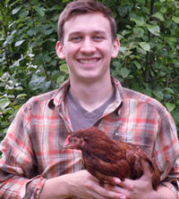

<table class="tg">
  <tr>
    <th class="tg-031e"></th>
    <th class="tg-031e">Adina Howe Assistant Professor  Iowa State University Agricultural and Biosystems Engineering

</th>

  </tr>

<tr>
    <th class="tg-031e"></th>
    <th class="tg-031e">Jinlyung Choi Postdoc</th>
  </tr>
  <tr>
    <th class="tg-031e"></th>
    <th class="tg-031e"><a href="http://ryanjw.github.io/">Ryan J. Williams</a> Postdoc</th>
  </tr>
<tr>
    <th class="tg-031e"></th>
    <th class="tg-031e">Daniel Shea, Graduate Student </th>
  </tr>
</table>
