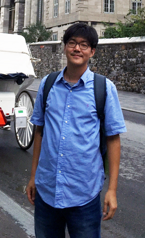
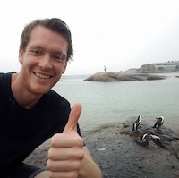

<table class="tg">
<tr>
<th class="tg-031e"></th>
<th class="tg-031e">Adina Howe, PI Assistant Professor  Iowa State University Agricultural and Biosystems Engineering

</th>
</tr>

<tr>
<th class="tg-031e"></th>
<th class="tg-031e"><a href="http://metajinomics.github.io/">Jinlyung (Jin) Choi</a>, PhD Postdoc

Interests: functional metagenomics, metatranscriptomics; computational biology; reproducible research; data science and training
 
 Hobbies: web design, sounds engineering, biking, hiking

</th>
</tr>

<tr>
<th class="tg-031e"></th>
<th class="tg-031e"><a href="http://metajinomics.github.io/">Jaejin (Jae) Lee</a>, PhD Postdoc

Interests: environmental & biological big data analysis
 
 Hobbies: playing cello, watching baseball

</th>
</tr>

<tr>
<th class="tg-031e"></th>
<th class="tg-031e">Lanying Ma, PhD
 Postdoc

Interests: microbiology, education, and training
 
 Hobbies: hiking, reading, playing with her kids

</th>
</tr>

<tr>
<th class="tg-031e"></th>
<th class="tg-031e">Nicole Ricker, PhD
 Postdoc

Interests:  mobile genetic elements; environmental science
 
 Hobbies:  music (guitar, cello), cycling, tennis, badminton, watching hockey and enjoying Belgian beer/chocolate

</th>
</tr>

<tr>
<th class="tg-031e"></th>
<th class="tg-031e">Phil Colgan
 PhD Student, ABE

Interests: sustainable energy and agriculture, synthetic biology, biosensing, education and training
 
 Hobbies: disc golfing, hiking, craft brews, playing musical instruments, wire wrapping

</th>
</tr>

<tr>
<th class="tg-031e"></th>
<th class="tg-031e">Shane Dooley
 PhD Student, BCB

Interests:  computational biology, genome editing,  and teaching the next generation of scientists. 
 
 Hobbies:  Spending time with my wife and kids, hunting, fishing, playing basketball

</th>
</tr>

<tr>
<th class="tg-031e"></th>
<th class="tg-031e">Jared Flater
 MS Student, ABE

Interests:  our natural resources; agroecosystems; data driven science
 
 Hobbies:  Spending time outside by playing disc golf or biking along Ames' great trail system

</th>
</tr>

<tr>
<th class="tg-031e"></th>
<th class="tg-031e">Hannah Guyer
 MS Student, ABE

Interests: water quality monitoring and management; human-environment interactions; sustainable agriculture
 
 Hobbies: hiking, traveling, watching college basketball, and petting dogs

</th>
</tr>

<tr>
<th class="tg-031e"></th>
<th class="tg-031e">Schuyler Smith
 PhD Student, BCB

Interests:  genomics; metagenomics; data analysis
 
 Hobbies:  games, reading, being active, not being active, sarcasm

</th>
</tr>

</table>

<b>GERMS Infections - Current Collaborators</b>

<u>Antimicrobial Resistance in the Environment (USDA, National Pork Board, University of Iowa, ISU)</u>

<table class="tg">
  <tr>
    <th class="tg-031e"></th>
    <th class="tg-031e">Antimicrobial Resistance:   Shannon Hinsa (Grinnell);  Heather Allen (USDA-ARS); Tom Moorman (USDA-ARS);  Michelle Soupir (ISU)  </th>
  </tr>

  <tr>
    <th class="tg-031e"></th>
    <th class="tg-031e">Liz Luby Rieke (PhD candidate) </th>
  </tr>

  <tr>
    <th class="tg-031e"></th>
    <th class="tg-031e">Tim Neher (MS student) </th>
  </tr>
</table>

[Diana Aga (University of Buffalo)](https://sites.google.com/site/agaresearchlab/)  
Matt Helmers (ISU)  
Lisa Schulte Moore (ISU)     

<u>Dimensions of Biodiversity:  Nectar Microbiomes (NSF) </u>

Tadashi Fukami (Stanford University)

<u>Harmful Algal Blooms in Recreational Waters (EPA, IDNR) </u>

Kaoru Ikuma (ISU)  
Elizabeth Swanner (ISU)  

<b>Collaborative Group Webpages:</b>

[Water Quality Research Lab](https://www.abe.iastate.edu/soupir/)  
[The Manure Scoop by Dr. Manure](http://themanurescoop.blogspot.com/)  
[Prairie STRIPS](https://www.nrem.iastate.edu/research/STRIPS/)  
[Aga Lab](https://sites.google.com/site/agaresearchlab/)   
[Fukami Lab](http://web.stanford.edu/~fukamit/)

<b>Past GERMS and Old Friends </b>

<table class="tg">
<tr>
<th class="tg-031e"></th>
<th class="tg-031e"><a href="http://fandemonium.github.io/">Fan Yang</a>, PhD
 Monsanto, San Diego, CA
</th>
</tr>

  <tr>
    <th class="tg-031e"></th>
    <th class="tg-031e"><a href="http://ryanjw.github.io/">Ryan J. Williams</a>, PhD Monsanto, St. Louis, MO &nbsp;&nbsp;&nbsp;&nbsp;&nbsp;&nbsp;&nbsp;&nbsp;&nbsp;&nbsp;&nbsp;&nbsp;&nbsp;&nbsp;&nbsp;&nbsp;&nbsp;&nbsp;&nbsp;&nbsp;&nbsp;&nbsp;&nbsp;&nbsp;&nbsp;&nbsp;&nbsp;&nbsp;&nbsp;&nbsp;&nbsp;&nbsp;&nbsp;&nbsp;&nbsp;&nbsp;&nbsp;&nbsp;&nbsp;&nbsp;&nbsp;&nbsp;&nbsp;&nbsp;&nbsp;&nbsp;&nbsp;&nbsp;&nbsp;&nbsp;&nbsp;&nbsp;&nbsp;&nbsp;&nbsp;&nbsp;&nbsp;&nbsp;&nbsp;&nbsp;&nbsp;&nbsp;&nbsp;&nbsp;&nbsp;&nbsp;&nbsp;&nbsp;&nbsp;&nbsp;&nbsp;&nbsp;&nbsp;&nbsp;&nbsp;&nbsp;&nbsp;&nbsp;&nbsp;&nbsp;&nbsp;&nbsp;&nbsp;

</th>
  </tr>
</table>

<b>GERMS Friends (Past Visiting Scholars)</b>

<table class="tg">
<tr>
    <th class="tg-031e"></th>
     <th class="tg-031e">Tomas Vetrovsky Academy of Sciences Czech Republic</th>
  </tr>

<tr>
    <th class="tg-031e"></th>
     <th class="tg-031e">Minjoo Lee Yonsei University</th>
  </tr>
  <tr>
    <th class="tg-031e"></th>
    <th class="tg-031e">Hyunji Yoo Yonsei University</th>
  </tr>

</table>
