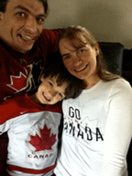
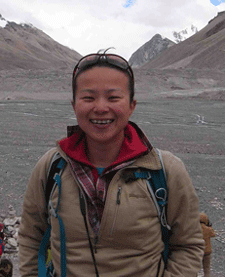
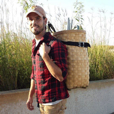
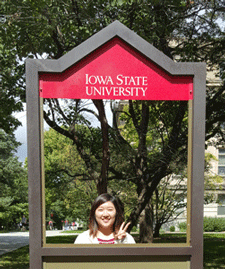

<table class="tg">
  <tr>
    <th class="tg-031e"></th>
    <th class="tg-031e">Adina Howe Assistant Professor  Iowa State University Agricultural and Biosystems Engineering

</th>
  </tr>

<tr>
    <th class="tg-031e"></th>
     <th class="tg-031e"><a href="http://metajinomics.github.io/">Jinlyung Choi</a> Postdoc

Interests: functional metagenomics, metatranscriptomics; computational biology; reproducible research; data science and training
 
 Hobbies: web design, sounds engineering, biking, hiking

</th>
  </tr>

<tr>
    <th class="tg-031e"></th>
    <th class="tg-031e">Nicole Ricker</a>
 Postdoc

Interests:  mobile genetic elements; environmental science 
 
 Hobbies:  music (guitar, cello), cycling, tennis, badminton, watching hockey and enjoying Belgian beer/chocolate
  

  </th>
</tr>

  <tr>
    <th class="tg-031e"></th>
    <th class="tg-031e"><a href="http://fandemonium.github.io/">Fan Yang</a>
 Postdoc

Interests:  how microorganisms contribute to our daily lives in natural and engineered systems
 
 Hobbies:  nature and outdoor sports, photography, playing guitar, and eating good food (om nom nom)

  </th>
</tr>

<tr>
    <th class="tg-031e"></th>
     <th class="tg-031e">Phil Colgan
</a> PhD Student, ABE

Interests: sustainable energy and agriculture, synthetic biology, biosensing, education and training
 
 Hobbies: disc golfing, hiking, craft brews, playing musical instruments, wire wrapping
</th>
</th>
  </tr>

  <tr>
    <th class="tg-031e"></th>
    <th class="tg-031e">Shane Dooley
 PhD Student, BCB

</th>
  </tr>

  <tr>
    <th class="tg-031e"></th>
    <th class="tg-031e">Jared Flater
 MS Student, ABE

Interests:  our natural resources; agroecosystems; data driven science
 
 Hobbies:  Spending time outside by playing disc golf or biking along Ames' great trail system

</th>

  </tr>

</table>

<b>GERMS Infections (Current Collaborators)</b>

<table class="tg">
  <tr>
    <th class="tg-031e"></th>
    <th class="tg-031e">DARTE-QM:  Shannon Hinsa (Grinnell); Heather Allen (USDA-ARS); Tom Moorman (USDA-ARS); Michelle Soupir (ISU)  </th>
  </tr>

</table>

<b>Past GERMS and Old Friends </b>

<table class="tg">
  <tr>
    <th class="tg-031e"></th>
    <th class="tg-031e"><a href="http://ryanjw.github.io/">Ryan J. Williams</a> Monsanto, San Diego, CA
</th>
  </tr>
</table>

<b>GERMS Friends (Past Visiting Scholars)</b>

<table class="tg">
  <tr>
    <th class="tg-031e"></th>
    <th class="tg-031e">Tomas Vetrovsky Academy of Sciences of the Czech Republic</th>
  </tr>

<tr>
    <th class="tg-031e"></th>
     <th class="tg-031e">Minjoo Lee Yonsei University</th>
  </tr>
  <tr>
    <th class="tg-031e"></th>
    <th class="tg-031e">Hyunji Yoo Yonsei University</th>
  </tr>

</table>
